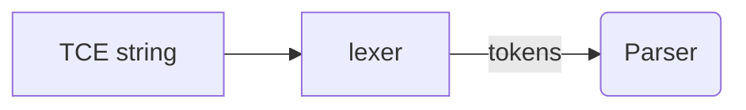

# Grammar Engine (CNL Pratt Parser)

This document explains how the **Controlled Natural Language (CNL) parser** works under the hood and how it maps directly into Tau AST nodes.

## Overview
The parser lives in `src/tau_translator_omega/core_engine/parsers/cnl_parser/cnl_parser.py` and is a hand-written Pratt parser.  It turns a TCE sentence into an abstract-syntax tree composed of lightweight `@dataclass` nodes.

Key design choices:
1. **Pratt Parsing** – enables precedence climbing with very small, composable functions.
2. **Frozen dataclasses** – AST nodes are immutable, supporting functional transforms.
3. **Token streaming** – a generator tokeniser feeds the Pratt functions; look-ahead is O(1).
4. **Result objects** – every public parse function returns `Result[AST, ParseError]` to honour ROP.

## Tokenisation Flow

* RegEx patterns live in `TOKEN_SPEC`.  Each yields `(type, value, span)` tuples.
* Whitespace and comments are skipped; failures become `Failure.LexError`.

## Pratt Functions
| Function | Purpose | Precedence |
|----------|---------|------------|
| `nud()`  | null denotation – literals, identifiers, prefix `not` | N/A |
| `led()`  | left denotation – infix logic `and`/`or`, comparisons | defined in table |
| `lbp()`  | left-binding power lookup | numeric |

Example snippet:
```python
if tok.type == "AND":
    return AndNode(left, self._expression(rbp=10), span)
```

## Extending for Quantifiers & Relative Clauses
* A new `nud` handles `FORALL IDENT ( … )` patterns.
* Relative clause keywords (`who`, `that`) are treated as **postfix filter expressions** attached to noun nodes.

## Error Recovery
* On unexpected tokens: skip until the next period `.` or EOL, emit `Failure.ParseError`.
* Parser never raises – always returns a `Result`.

## AST → Tau Mapping
* Single-dispatch visitor in `TCETauTranslator` – each node has a corresponding `@visitor` method.
* Pattern ensures open/closed principle: add new AST node, implement visitor, tests stay green.

## Testing Strategy
1. **Golden fixtures** – `.tce` → `.ast.json` snapshot (property tests ensure idempotence).
2. **Mutation tests** – `mutmut` run on parser directory.
3. **Boundary cases** – deeply nested parentheses, long coordinate clauses.

---
_Last updated: 2025-06-23_
